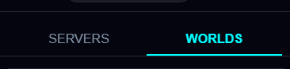
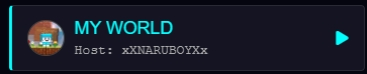
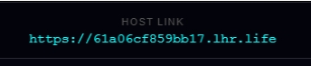
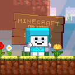

# VCMC 🎙️🌐

**VCMC** es la herramienta definitiva para integrar comunicación avanzada en tus partidas de Minecraft, ya sea en mundos locales o servidores dedicados.

  

---

## 🚀 Cómo empezar

La aplicación se divide en dos secciones principales: **Servers** y **Mundos**. Ambas requieren que el mundo o servidor tenga instalado su respectivo **Addon**.

---

## 🌍 Modo: Mundos (P2P)

Ideal para jugar con amigos en mundos locales mediante conexión directa.

### Para el Anfitrión (Host):
1. Dirígete a la pestaña **Mundos** y selecciona la opción **Mi Mundo**.
   
2. Una vez dentro de la sala, verás un **Link** en la parte superior.
   
3. Haz clic en el link para copiar el comando automáticamente al portapapeles.
4. **En Minecraft:** Pega el comando en el chat de tu mundo.
   > ⚠️ **Requisitos críticos:** > * Debes tener los **trucos activados**.
   > * En los ajustes de tu **Perfil** dentro de Minecraft, la opción **"Uso de WebSocket"** debe estar habilitada.

### Para los Invitados:
1. En la pestaña **Mundos**, toca el botón de **Agregar Amigo** (+) situado en la parte inferior derecha.
   
2. Agrega al host por su gamertag. Una vez agregado, haz clic sobre su nombre en la lista.
3. Entrarás a una sala común donde verás a todos los participantes. 
4. **¡Listo!** No necesitas hacer nada más en la app, solo únete al mundo de tu amigo en Minecraft.

---

## 🖥️ Modo: Servers

Configuración para comunidades y servidores dedicados.

1. Ve a la pestaña **Servers** y pulsa el botón de agregar.
2. Introduce la **IP** y el **Puerto** del servidor al que deseas conectarte.
3. Al entrar a la sala del servidor, todos los miembros verán un **Link** en la parte superior.
4. **Activación:** Solo **un usuario** necesita copiar el link y pegar el comando en el chat del servidor de Minecraft.
   * Al hacerlo, todos los demás usuarios en la sala se conectarán automáticamente.
   * *Nota:* Si todos los jugadores abandonan el servidor, el primero en volver a entrar deberá ejecutar el comando de nuevo.
   * **Diferencia clave:** En este modo **no es necesario** activar los WebSockets en el perfil de Minecraft.

---

## 🛠️ Tabla de Requisitos

| Característica | Mundo Local (Host) | Servidores (IP/Puerto) |
| :--- | :--- | :--- |
| **Addon instalado** | ✅ Obligatorio | ✅ Obligatorio |
| **Trucos activos** | ✅ Requerido | ✅ Requerido |
| **WebSocket Perfil** | ✅ Requerido | ❌ No necesario |

---

## 👤 Creador

  
   
  Desarrollado por <b>Naru</b>

